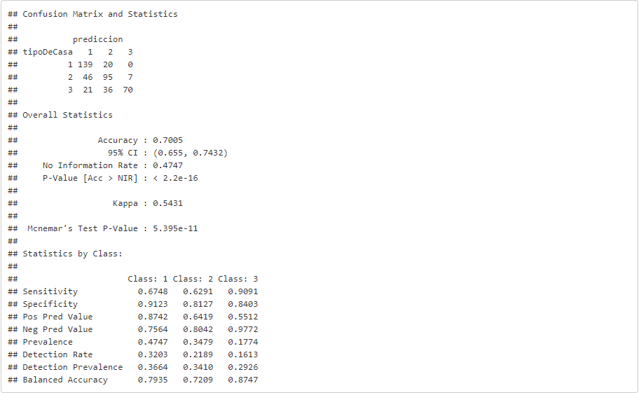
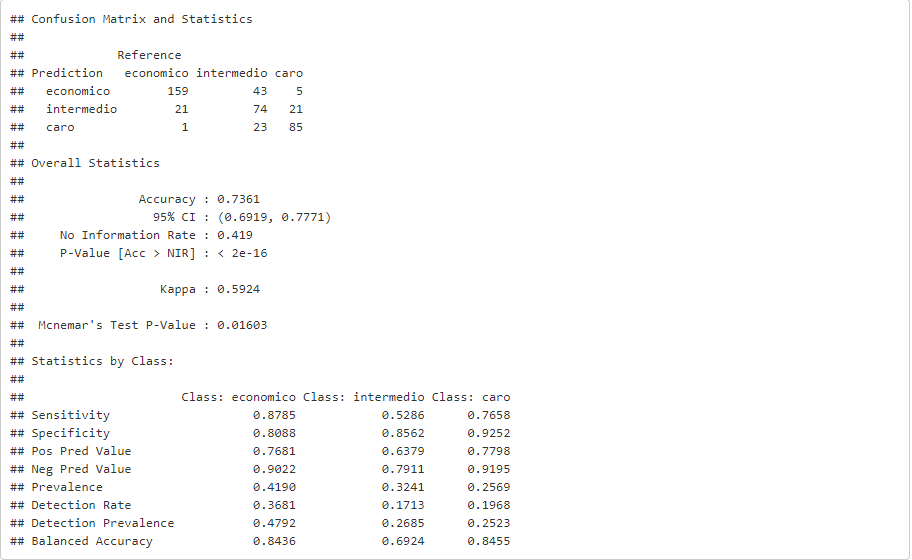

```{r setup, include=FALSE}
knitr::opts_chunk$set(echo = TRUE)
```

## Analisis
En esta HDT se trabajara con el modelo svm de la librería e1071  y varias otras funciónes que requieren transformaciónes de data. Primero se nos pide que se genere una variable que defina entre economico, caro e intermedio que ya se había hecho en hojas de trabajo pasadas. Dado que los datos máximos atípicos afectan considerablemente a una predicción, no se categorizan entre ninguna de las tres clasificaciónes por lo que se producen valores NA en nuestra variable tipoDeCasa. Para solventar este problema, eliminaremos las filas que tienen NA en la variable tipoDeCasa. Tambien es importante que las variables cuantitativas no tengan NA en ellas, por lo que las cambiamos por 0 tomando en cuenta lo que representa cada variable.
```{r echo=FALSE, message=FALSE, warning=FALSE}
library(e1071)
library(caret)
library(corrplot)
library(labelled)
library(plotly)
library(ggplot2)
# Load Data
set.seed(123)
df = read.csv("./train.csv")
df[is.na(df)] <- 0
df$tipoDeCasa = as.numeric(as.character( cut(df$SalePrice,c(0,145000,205000,410000), labels = c(1, 2, 3))))
df[sapply(df, is.character)] <- lapply(df[sapply(df, is.character)],as.factor)
#Para borrar filas que tengan NA en una columna en especifico.
#https://stackoverflow.com/questions/11254524/omit-rows-containing-specific-column-of-na
completeFun <- function(data, desiredCols) {
  completeVec <- complete.cases(data[, desiredCols])
  return(data[completeVec, ])
}
df <- completeFun(df, "tipoDeCasa")
str(df)
#X1stFlrSF      col#44
#BsmtFullBath   col#48
#TotRmsAbvGrd   col#55
#X2ndFlrSF      col#45
#GrLivArea      col#47
#GarageArea     col#63

#Separo datos con factor level > 2
frstselect <- df[,c(2:5,8,9,11:43,46,49:54,56:62,64:72,76:80,82)]

#Separo datos cuantitativos
scndselect <- subset (df, select = c(2,4,5,18,19,20,21,27,35,37,38,39,44,45,46,47,48,49,50,51,52,53,55,57,60,62,63,67,68,69,70,71,72,76,77,78,82))
scndselect[is.na(scndselect)] <- 0
```
Vamos a hacer un analisis de correlación, para descartar las variables cuantitativas que tienen mucha correlación entre ellas y así facilitar la fase del modelo. Para esto, se decidió separar la base de datos en dos conjuntos de datos, ya que son muchas columnas. La primer matriz hace referencia al conjunto1, la segunda hace referencia al conjunto2, la tercera es la matriz de correlación entre conjunto1 y conjunto2. Por último tenemos una tabla comparativa que nos permite ver con mayor facilidad la correlación entre la variable tipoDeCasa y todas las demás.
```{r echo=FALSE, message=FALSE, warning=FALSE}
#Correlacion
M <- cor(scndselect[,c(1:18)])
M1<- cor(scndselect[,c(19:37)])
M2<- cor(scndselect[,c(1:18)],scndselect[,c(19:37)])

col <- colorRampPalette(c("#BB4444", "#EE9988", "#FFFFFF", "#77AADD", "#4477AA"))
corrplot(M,  method = "color", col = col(200), order = "hclust", number.cex = .5,
         addCoef.col = "black",
         tl.col = "black",
         sig.level = 0.50, insig = "blank", 
         diag = FALSE)
corrplot(M1,  method = "color", col = col(200), order = "hclust", number.cex = .5,
         addCoef.col = "black",
         tl.col = "black",
         sig.level = 0.50, insig = "blank", 
         diag = FALSE)
corrplot(M2,  method = "color", col = col(200), order = "hclust", number.cex = .5,
         addCoef.col = "black",
         tl.col = "black",
         sig.level = 0.50, insig = "blank", 
         diag = TRUE)

tipocor<- cor(scndselect[,-1],scndselect$tipoDeCasa)
tipocor
```
Basandonos en la gráfica de correlación y el cuadro de correlación, las variables con mayor correlación con la variable tipoDeCasa son:

- OverallQual (cuantitativa)
- GarageCars  (cuantitativa)

Tambien sabemos que las variables que tienen una correlación entre ellas mayor a 0.6 son:

- TotalBsmtSF con X1stFlrSF 
- BsmtFinSF1 con BsmtFullBath
- X2ndFlrSF con GrLivArea con HalfBath con TotRmsAbvGrd
- FullBath con GrLivArea
- GarageCars con GarageArea 
- BedroomAbvGr con TotRmsAbvGrd

A continuación se verifica la correlación con la variable tipoDeCasa y se quitan las variables con menor correlación entre los conjuntos que tenían correlacion mutua, por lo tanto sacaremos a las siguientes variables:

- X1stFlrSF
- BsmtFullBath
- TotRmsAbvGrd
- X2ndFlrSF
- GrLivArea
- GarageArea

## Modelo de SVM
Uno de los principales requisitos es que los "factors" sean de al menos 2 niveles para poder ser ingresados a la función de svm. En totala se realizarán nueve modelos de los cuales 3 son lineales, 3 son radiales y 3 son polinomiales. Se cambiaron factores como costo, gamma, degree y coef0 para tener diferentes combinaciones que nos dieran diferentes resultados y en base a cada combinación, se buscaron numeros que promovieran una mayor precisión en la predicción.
```{r echo=FALSE, message=FALSE, warning=FALSE}
#Variables a sacar:
#X1stFlrSF      col#44
#BsmtFullBath   col#48
#TotRmsAbvGrd   col#55
#X2ndFlrSF      col#45
#GrLivArea      col#47
#GarageArea     col#63

# Select train y test
porciento <- 70/100
#Con todo tipo de variable
trainRowsNumber<-sample(1:nrow(frstselect),porciento*nrow(frstselect))
train<-frstselect[trainRowsNumber,]
test<-frstselect[-trainRowsNumber,]

#Con variables cuantitativas
trainRowsNum<-sample(1:nrow(scndselect),porciento*nrow(scndselect))
train1<-scndselect[trainRowsNum,]
test1<-scndselect[-trainRowsNum,]

#Modelos

modeloSVM_L1<-svm(tipoDeCasa~., data=train,type="C-classification", cost=2^5, kernel="linear") 
modeloSVM_L2<-svm(tipoDeCasa~., data=train,type="C-classification", cost=0.5, kernel="linear")
modeloSVM_L3<-svm(tipoDeCasa~., data=train,type="C-classification", cost=2^-5, kernel="linear")

modeloSVM_R1<-svm(tipoDeCasa~., data=train,type="C-classification", gamma=0.005,kernel="radial")
modeloSVM_R2<-svm(tipoDeCasa~., data=train,type="C-classification", gamma=0.05,kernel="radial")
modeloSVM_R3<-svm(tipoDeCasa~., data=train,type="C-classification", gamma=2^-5,kernel="radial")

modeloSVM_P1<-svm(tipoDeCasa~., data=train,type="C-classification", gamma=1, kernel="polynomial", coef0=1, degree= 8) 
modeloSVM_P2<-svm(tipoDeCasa~., data=train,type="C-classification", gamma=5, kernel="polynomial", coef0=1)
modeloSVM_P3<-svm(tipoDeCasa~., data=train,type="C-classification", gamma=2^-5, kernel="polynomial", coef0=1)

summary(modeloSVM_L1)
summary(modeloSVM_R1)
summary(modeloSVM_P1)

#Predicciones

# Linear
process_timeL1 <- proc.time()
prediccionL1<-predict(modeloSVM_L1,newdata=test[,1:67])
process_timeL1 <- proc.time() - process_timeL1
process_timeL2 <- proc.time()
prediccionL2<-predict(modeloSVM_L2,newdata=test[,1:67])
process_timeL2 <- proc.time() - process_timeL2
process_timeL3 <- proc.time()
prediccionL3<-predict(modeloSVM_L3,newdata=test[,1:67])
process_timeL3 <- proc.time() - process_timeL3

process_timeL_avarage <- (process_timeL1[3] + process_timeL2[3] + process_timeL3[3])/3


# Radial
process_timeR1 <- proc.time()
prediccionR1<-predict(modeloSVM_R1,newdata=test[,1:67])#[,1:37]
process_timeR1 <- proc.time() - process_timeR1
process_timeR2 <- proc.time()
prediccionR2<-predict(modeloSVM_R2,newdata=test[,1:67])#[,1:37]
process_timeR2 <- proc.time() - process_timeR2
process_timeR3 <- proc.time()
prediccionR3<-predict(modeloSVM_R3,newdata=test[,1:67])#[,1:37]
process_timeR3 <- proc.time() - process_timeR3

process_timeR_avarage <- (process_timeR1[3] + process_timeR2[3] + process_timeR3[3])/3

# Polinomial
process_timeP1 <- proc.time()
prediccionP1<-predict(modeloSVM_P1,newdata=test[,1:67])
process_timeP1 <- proc.time() - process_timeP1
process_timeP2 <- proc.time()
prediccionP2<-predict(modeloSVM_P2,newdata=test[,1:67])
process_timeP2 <- proc.time() - process_timeP2
process_timeP3 <- proc.time()
prediccionP3<-predict(modeloSVM_P3,newdata=test[,1:67])
process_timeP3 <- proc.time() - process_timeP3

process_timeP_avarage <- (process_timeP1[3] + process_timeP2[3] + process_timeP3[3])/3

#Cambio de tipo de data a factors
test$tipoDeCasa<- as.factor(test$tipoDeCasa)
test1$tipoDeCasa<- as.factor(test$tipoDeCasa)

```

## Matrices de confusión:
Para esta parte hay que asegurar que ambos factores que se van a comparar que en este caso es predicción y test, es requerido que sean factores del mismo nivel, por lo que no puede haber ninún tipo de fallo en el formato de ambos factores. A continuación se pueden ver los resultados de los 9 modelos que se realizaron.

#### - Matrices de confusión de modelos lineales
```{r echo=FALSE, message=FALSE, warning=FALSE}
cmL1<-confusionMatrix(test$tipoDeCasa,prediccionL1)
cmL2<-confusionMatrix(test$tipoDeCasa,prediccionL2)
cmL3<-confusionMatrix(test$tipoDeCasa,prediccionL3)
cmL1
cmL2
cmL3
```

#### - Matrices de confusión de modelos radiales 
```{r echo=FALSE, message=FALSE, warning=FALSE}
cmR1<-confusionMatrix(test$tipoDeCasa,prediccionR1)
cmR2<-confusionMatrix(test$tipoDeCasa,prediccionR2)
cmR3<-confusionMatrix(test$tipoDeCasa,prediccionR3)
cmR1
cmR2
cmR3
```

#### - Matrices de confusión de modelos polinomiales 
```{r echo=FALSE, message=FALSE, warning=FALSE}
cmP1<-confusionMatrix(test$tipoDeCasa,prediccionP1)
cmP2<-confusionMatrix(test$tipoDeCasa,prediccionP2)
cmP3<-confusionMatrix(test$tipoDeCasa,prediccionP3)
cmP1
cmP2
cmP3
#Obtener accuracy de cada una
cmL1<-cmL1$overall[['Accuracy']]*100
cmL2<-cmL2$overall[['Accuracy']]*100
cmL3<-cmL3$overall[['Accuracy']]*100
cmR1<-cmR1$overall[['Accuracy']]*100
cmR2<-cmR2$overall[['Accuracy']]*100
cmR3<-cmR3$overall[['Accuracy']]*100
cmP1<-cmP1$overall[['Accuracy']]*100
cmP2<-cmP2$overall[['Accuracy']]*100
cmP3<-cmP3$overall[['Accuracy']]*100
accuracycm1<- c(cmL1,cmR1,cmP1)
accuracycm2<- c(cmL2,cmR2,cmP2)
accuracycm3<- c(cmL3,cmR3,cmP3)
tiposvmcm<- c("linear","radial","polinomial")
accuracycm4<- c(cmL1,cmL2,cmL3)
accuracycm5<- c(cmR1,cmR2,cmR3)
accuracycm6<- c(cmP1,cmP2,cmP3)
data <- data.frame(tiposvmcm, accuracycm1, accuracycm2, accuracycm3)
```

#### Matríz de confusión Naive Bayes 


#### Matríz de confusión Regression Lineal


#### Matríz de confusión Arbol de Clasificación 


#### Comparar modelos SVM
- En la siguiente gráfica se puede apreciar la comparación entre presiciones de los nueve modelos que se realizaron, agrupados por tipo de kernel. 
```{r echo=FALSE, message=FALSE, warning=FALSE}
fig <- plot_ly(data, x = ~tiposvmcm, y = ~accuracycm1, type = 'bar',text = paste(signif(accuracycm1,digits = 3),"%"), textposition = 'auto', name = '')
fig <- fig %>% add_trace(y = ~accuracycm2, name = '',text = paste(signif(accuracycm2,digits = 3),"%"), textposition = 'auto')
fig <- fig %>% add_trace(y = ~accuracycm3, name = '',text = paste(signif(accuracycm3,digits = 3),"%"), textposition = 'auto')
fig <- fig %>% layout(title="(Accuracy vs kernel type) of SVM",yaxis = list(title = 'Accuracy(%)'),xaxis = list(title = 'kernel'), barmode = 'group')
fig
```

#### Comparar modelos de hojas pasadas
A continuacion veremos una grafica comparativa de las precisiones obtenidas de los modelos de prediccion aplicados anteriormente, incluyendo SVM's.

```{r echo=FALSE, message=FALSE, warning=FALSE}
modelos_aplicados <- c("Arbol de Clasificacion","Naive Bayes","Regresion Lineal", "SVM")
accuracy_individual <- c(73.61, 76.69, 70.05, 83.99)
comparacion_modelos <- data.frame(modelos_aplicados, accuracy_individual)
fig_2 <- plot_ly(comparacion_modelos, x = ~modelos_aplicados, y = ~accuracy_individual, type = 'bar', text = paste(signif(accuracy_individual,digits = 3),"%"), textposition = 'auto', name = '')
fig_2 <- fig_2 %>% layout(title="Accuracy vs Modelo Aplicado",yaxis = list(title = 'Accuracy(%)'),xaxis = list(title = 'Modelo Aplicado'), barmode = 'group')
fig_2
```
#### Comparar tiempos de ejecucion de cada modelo SVM
Debajo se muestra una comparacion en promedio del tiempo de ejecucionde cada uno de los modelos: 

```{r echo=FALSE, message=FALSE, warning=FALSE}

modelos_SVM <- c("Lineal", "Radial", "Polinomial")
elapsed <- c(process_timeL_avarage, process_timeR_avarage, process_timeP_avarage)

comparacion_elapsed <- data.frame(modelos_SVM, elapsed)

fig_3 <- plot_ly(comparacion_elapsed, x = ~modelos_SVM, y = ~elapsed, type = 'bar', text = paste(signif(elapsed,digits = 3),"s"), textposition = 'auto', name = '')
fig_3<- fig_3 %>% layout(title="Tiempo de Ejecucion vs Modelo Aplicado",yaxis = list(title = 'Time(s)'),xaxis = list(title = 'Modelo Aplicado'), barmode = 'group')

fig_3
```

## Discusión
Al haber hecho la comparación entre cada modelo de los de la support vector machine, podemos ver que el más alto es el lineal con 84% el segundo con 83.3% en radial y el tercero en radial tambien con un 82.6%. Un dato importante es que el porcentaje de precisión más bajo es de 74.5% lo que de igual manera es una porcentaje de accuracy bastante formidable. Como conclusión no se puede determinar qué modelo es el mejor, pero sí qué modelo nos dio mejores resultados, y fue el lineal. Con resultados muy parecidos al polinomial y radial. De igual manera, el tiempo de ejecucion mas bajo fue el lineal, seguido por el polinomial y por ultimo el radial. En este caso el modelo mas eficiente obtuvo un menor tiempo de ejecucion. Ahora en comparación con los otros modelos que se realizaron en hojas de trabajo anteriores, podemos también determinar que en esta hoja de trabajo obtuvo los índices de accuracy más altos a los que se ha llegado. En conclusión como se menciona anteriormente no se pudo determinar un modelo ganador ya que si se tuviera un conocimiento más amplio el tema de cada uno de los modelos que se realizaron. Posiblemente se hubiera tratado de una manera más delicada a cada variable que influye en el resultado de cada modelo, en otras palabras consideramos que se pudo haber probado miles de combinaciones por modelo(las cuales no se probaron por cuestiones de tiempo) y tener más conocimiento para poder determinar qué modelo es más eficiente para esta base de datos y en este caso en particular.

Tomando como referencia el modelo de la con la clasificación y el regreso lineal estos fueron los que nos dieron un una menor tasa de efectividad el que las de Naive Bayesy por último SVM.
Las principales diferencias que podemos encontrar entre cada uno de los modelos están dentro de las matrices de confusión. Como primer modelo tenemos no hay Valles en este caso obtuvimos una crisis de 0.76 pero esta nos muestra una mejor predicción en comparación con la regresión lineal, donde obtuvimos un 0.70 de efectividad. La principal diferencia está entre la precisión de casas del tipo caro pues el modelo de regresión lineal obtuvo una mayor cantidad de errores en este caso.

Ahora tomando como referencia del árbol de clasificación podemos ver que en el tipo de casa caro obtuvimos una menor cantidad de errores y eso se puede ver reflejado en la gráfica anterior sin embargo Naive Bayes sigue proporcionarnos una menor tasa de errores y mejor aproximación. La principal diferencia entre estos tres modelos y SVM, la podemos ver en los resultados de la gráfica anterior puesto que el promedio entre las entre estos tres modelos es de 73.44% en comparación al 84% que nos brinda SVM tenemos una diferencia de aproximadamente un 10% entre estos modelos, esto nos indica que SM nos brinda una mejor certeza para este set datos.Por último, en los tiempos de ejecucuión de cada modelo SVM, podemos notar que cuando se usa el kernel lineal es más eficiente, seguido del kernel polinomial dejando al radial como el modelo más tardado. Aunque si la computadora está haciendo algúm tipo de tarea que altere la capacidad de procesamiento, esto puede afectar a la eficiencia de los tipos de kernel del modelo cambiando de manera considerable la gráfica de comparación de tiempos de ejecución.


