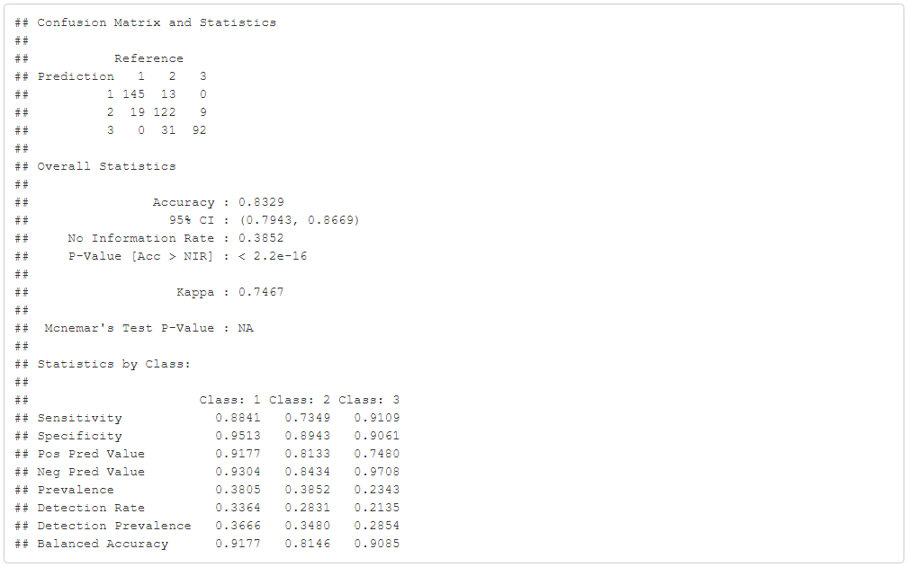

```{r setup, include=FALSE}
knitr::opts_chunk$set(echo = TRUE)
```

## Analisis

En esta hoja de trabajo se generaran dos modelos de redes neuronales que sean capaces de clasificar usando la variable de respuesta que categoriza las casas en baratas, medias y caras. Estos modelos tendran diferentes topologias y funciones de activacion. Estos modelos se utilizaran para predecir la variable de respuesta. Asimismo, se realizaran las matrices de confucion y se compararan los resultados. Seguido de esto, se realizara el mismo proceso pero para la variable SalesPrice, de manera que el algoritmo prediga el precio de las casas. 

```{r echo=FALSE, warning=FALSE, include=FALSE}
# Librerias
library(caret)
library(nnet)
library(RWeka)
library(neural)
library(dummy)
library(neuralnet)
library(plotly)
library(MASS)
library(neuralnet)
library(ggplot2)
library(PerformanceAnalytics)
```

Inicialmente se separan los datos cuantitativos. En base a las hojas realizadas anteriormente, se decidio por descartar las variables que tienen mucha correlacion entre si y asi facilitar la creacion de los modelos. 

## Variable de Respuesta "tipoDeCasa"

### Red Neuronal con caret

A continuacion se muestra el modelo generado con caret: 

```{r echo=FALSE, warning=FALSE, include=FALSE}
#Obtención de datos
datos = read.csv("./train.csv")
set.seed(123)

#División de 3 cosas
datos[is.na(datos)] <- 0
datos$tipoDeCasa = as.numeric(as.character( cut(datos$SalePrice,c(0,145000,205000,410000), labels = c(1, 2, 3))))

#Para borrar filas que tengan NA en una columna en especifico.
#https://stackoverflow.com/questions/11254524/omit-rows-containing-specific-column-of-na
completeFun <- function(data, desiredCols) {
  completeVec <- complete.cases(data[, desiredCols])
  return(data[completeVec, ])
}
datos <- completeFun(datos, "tipoDeCasa")

#Separo datos cuantitativos
scndselect <- subset(datos, select = c(2,4,5,18,19,20,21,27,35,37,38,39,44,45,46,47,48,49,50,51,52,53,55,57,60,62,63,67,68,69,70,71,72,76,77,78, 81, 82))
scndselect[is.na(scndselect)] <- 0
```

```{r echo=FALSE, warning=FALSE, include=FALSE}
# Red Neuronal con caret

porcentaje<-0.7
corte <- sample(nrow(scndselect),nrow(scndselect)*porcentaje)
train<-scndselect[corte,]
test<-scndselect[-corte,]

modeloCaret <- train(tipoDeCasa~., data=train, method="nnet",preProcess=c("scale","center"), na.action = na.omit, linout = TRUE)# Por defecto el modelo usa la funcion de activacion sigmoide
```

```{r echo=FALSE}
modeloCaret
```

Para generar el modelo se aplico el parametro de preProcess. Este nos ayudo a centrar y escalar la data. Es decir, se normalizaron todas las columnas y sus registros para que no haya disparidad en el entrenamiento del modelo y en las predicciones.

Seguido de esto vemos la prediccion y su matriz de confusion:

```{r echo=FALSE, warning=FALSE}
process_timeC1 <- proc.time()
test$prediccionCaret <- predict(modeloCaret, newdata = test)
process_timeC1 <- proc.time() - process_timeC1
test$prediccionCaret[] <- round(test$prediccionCaret, digits = 0)
u <- union(test$prediccionCaret,test$tipoDeCasa)
t <- table(factor(test$prediccionCaret, u), factor(test$tipoDeCasa, u))
cfmCaret<-confusionMatrix(t)
cfmCaret
```

Tiempo de ejecucion: 

```{r echo=FALSE}
process_timeC1
```

Dado que el algoritmo retornaba valores entre 0 y 3 debimos redondear estos numeros para que calleran dentro de una de nuestras clasificaciones de tipo de casa (1, 2, 3).

### Red Neuronal con NNet

A continuacion se muestra el modelo generado con NNet, en donde se realizo un entrenamiento con un maximo de 300 iteraciones: 

```{r echo=FALSE}
# Red Neuronal con NNet
modelo.nn2 <- nnet(tipoDeCasa~.,data = scndselect,subset = corte, size=25, rang=0.1, decay=5e-4, maxit=300, linout = TRUE)# por defecto el modelo utiliza la funcion de activacion logistica
process_timeNNet1 <- proc.time()
prediccion2 <- round(predict(modelo.nn2, newdata = test[,1:37]))
process_timeNNet1 <- proc.time() - process_timeNNet1
```

Tiempo de ejecucion:

```{r echo=FALSE}
process_timeNNet1
```

Es importante recalcar que se realizaron unicamente 300 iteraciones, dado que de realizarse mas se podria caer en overfiting, y no se desea eso. 

Seguido de esto vemos la prediccion y su matriz de confusion:

```{r echo=FALSE}

test$prediccion2<-prediccion2 #Se le añade al grupo de prueba el valor de la predicción
u <- union(test$prediccion2,test$tipoDeCasa)
t <- table(factor(test$prediccion2, u), factor(test$tipoDeCasa, u))
cfm<-confusionMatrix(t)
cfm
```

### Comparacion de Resultados con otros modelos de clasificacion

#### Matríz de confusión Naive Bayes 


#### Matríz de confusión Regression Lineal


#### Matríz de confusión Arbol de Clasificación 


#### Matríz de confusión SVM
- Modelos Lineales

- Modelos Radiales

- Modelos Polinomiales


Debajo tenemos una grafica comparativa del Accuracy obtenido de los modelos utilizados para las predicciones:

```{r echo=FALSE}
modelos_prediccion <- c("Naive Bayes", "Regresion Lineal", "Arbol de Clasificacion", "SVM", "Neural Net(Caret)", "Neural Net(NNet)")
accuracies <- c(76.69, 70.05, 73.61, 83.99, 85.85, 85.61)

comparacion_prediccion <- data.frame(modelos_prediccion, accuracies)

fig_1 <- plot_ly(comparacion_prediccion, x = ~modelos_prediccion, y = ~accuracies, type = 'bar', text = paste(signif(accuracies,digits = 4),"%"), textposition = 'auto', name = '')
fig_1<- fig_1 %>% layout(title="Precision del modelo vs Modelo Aplicado",yaxis = list(title = 'Accuracy(%)'),xaxis = list(title = 'Modelo Aplicado'), barmode = 'group')

fig_1
```

## Variable de Respuesta "SalePrice"

### Red Neuronal con NNet

Al predecir el valor de SalePrice nos vemos con otro nivel de dificultad, ya que debemos hacer una prediccion de multiples valores discretos. Para ello optamos por normalizar la data mediante el metodo de normalizacion Min-Max. Este metodo de normalizacion convierte cada valor en un rango entre 0 y 1. Para ello se aplica la siguiente formula: x'=(x-min(x))/(max(x)-min(x)). Luego de entrenar el modelo con la data normalizada se tuvo que desnormalizar para luego calcular el porcentage de error de cada prediccion. El porcentage de error se obtuvo de la siguiente manera: (|aprox-real|/real)*100. 

```{r echo=FALSE}
#normalizacion Min-Max de los datos
maxs      <- apply(train, 2, max)
mins      <- apply(train, 2, min)

datos_normalized <- as.data.frame(scale(scndselect, center = mins, scale = maxs - mins))
train_normalized <- datos_normalized[corte, ]
test_normalized  <- datos_normalized[-corte, ]

#modelo
modelo.nnet <- neuralnet(SalePrice~., data = train_normalized, hidden = c(7,5), threshold = 0.05, algorithm     = "rprop+")

#Prediccion
pr.nnet   <- compute(modelo.nnet,within(test_normalized,rm(SalePrice)))

#Se desnormaliza los valores
SalePrice.predict <- pr.nnet$net.result*(max(datos$SalePrice)-min(datos$SalePrice))+min(datos$SalePrice)
SalePrice.real    <- (test_normalized$SalePrice)*(max(datos$SalePrice)-min(datos$SalePrice))+min(datos$SalePrice)

# Calcular el accuracy individual mediante el error
SalePrice_predict_vs_real <- data.frame(SalePrice.predict, SalePrice.real)
SalePrice_predict_vs_real$accuracy <- 0
SalePrice_predict_vs_real$accuracy[] <- (1 - abs(SalePrice_predict_vs_real$SalePrice.real - SalePrice_predict_vs_real$SalePrice.predict)/SalePrice_predict_vs_real$SalePrice.real)*100 # Se predijo el accuracy con 1 - %error
```

Finalmente se hizo un promedio de todos los porcentajes de error restados de 1 para obtener la precision de nuestro modelo.

A continuacion vemos el accuracy promedio de las predicciones de SalePrice con NNet:

```{r echo=FALSE}
mean(SalePrice_predict_vs_real$accuracy)
```

### Discucion

Al comparar los resultados obtenidos con los diferentes modelos de clasificacion usando redes neuronales para estimar la variable de respuesta "tipoDeCasa" podemos ver que las redes neuronales realizadas por la librería de Caret fueron las más efectivas con un 85.85% de precision y con una diferencia de 0.24% respecto a las formas por la librería NNet con una presicion de 85.61%. No se puede determinar qué modelo es el mejor, pero sí qué modelo nos dio mejores resultados, y fue el modelo de redes neuronales con Caret. Siendo este el modelo más efectivo, ahora partiendo del tiempo de ejecución podemos decir que de la librería Caret fue el más efectivo comparado con la otra librería de redes neuronales que fue bastante más complicado de efectuar y acomodar el modelo para poder hacerlo funcionar. Ahora en comparación con los otros modelos que se realizaron en hojas de trabajo anteriores, podemos también determinar que en esta hoja de trabajo obtuvo los índices de accuracy más altos a los que se ha llegado. En conclusión como se menciona anteriormente no se pudo determinar un modelo ganador ya que si se tuviera un conocimiento más amplio el tema de cada uno de los modelos que se realizaron. Posiblemente se hubiera tratado de una manera más delicada a cada variable que influye en el resultado de cada modelo, en otras palabras consideramos que se pudo haber probado miles de combinaciones por modelo(las cuales no se probaron por cuestiones de tiempo) y tener más conocimiento para poder determinar qué modelo es más eficiente para esta base de datos y en este caso en particular.

Aunque también se puede resaltar que ningún algoritmo tuvo una efectividad baja o menor al 70% dentro de todos los algoritmos utilizados únicamente las redes neuronales fueron mucho más efectivas para realizar la prediccion sin embargo ninguno tuvo efectividad extremadamente baja. 

En este caso el algoritmo recargar recargar como el “el menos efectivo“ sería la regresión lineal, puede que esto se deba a que no es ideal para la predicción, sin embargo fue muy efectivo.